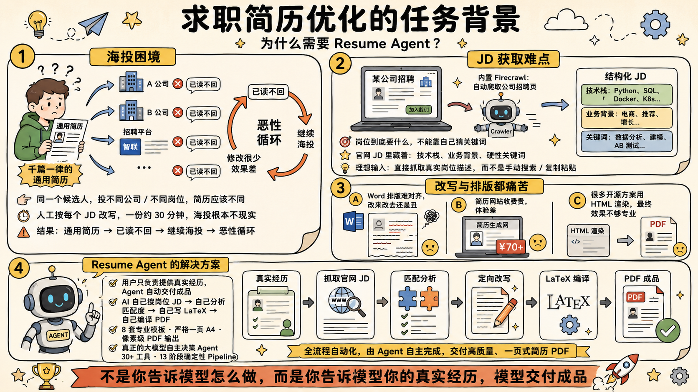
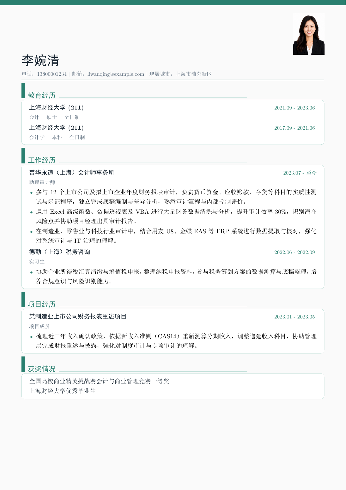
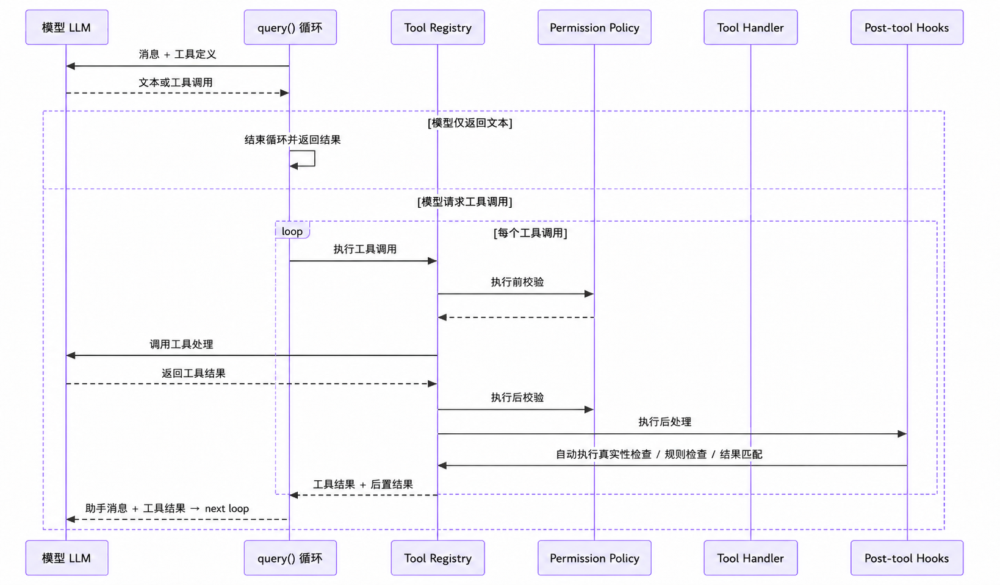
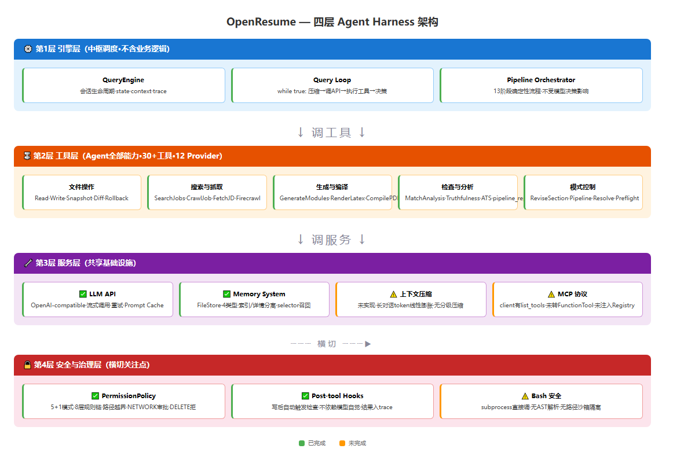

<div align="center">

# 🔥 OpenResume — 一个真正的 LLM Agent，帮你找到工作

[](https://github.com)
[](https://github.com)
[](https://github.com)
[](https://www.python.org/)
[](https://github.com)

<br>

### 为什么要做这个项目？

<br>



<br>

**背景**。投简历这件事，每个人都要经历，而同一个候选人，投不同公司、不同岗位，简历应该是不同的。对应的HR看简历的时候看重的能力不一样、侧重的项目经历也应该不一样。但人工针对每个 JD 改写简历，一份就要半小时，所以海投根本不现实。结果是：千篇一律的通用简历 → 已读不回 → 继续海投 → 恶性循环。

**简历优化首先要搞清楚岗位到底要什么**。最理想的输入不是你自己猜的关键词，而是公司官网上的真实岗位描述。JD 里面藏着这个岗位真正的技术栈要求、业务背景、以及 HR 筛选时的硬性关键词——这些信息靠猜是猜不到的。所以这个 Agent 的第一步不是让你自己去搜 JD、复制粘贴，而是内置了 Firecrawl 爬取引擎，直接把公司招聘页的岗位介绍爬下来：字节跳动、腾讯、阿里等公司的官方招聘页都支持。有了真实的 JD 之后，Agent 才会进入后续的匹配分析和定向改写——这才是"针对岗位优化简历"该有的样子，而不是对着一个模模糊糊的岗位名字瞎改。

**已有的简历修改模式非常丑陋**。自己改简历排版非常折磨人。1.通常都是用word来排版，格式非常难对齐。以我的经历来说在word上改来改去最后的呈现的简历还是非常丑。2.要么就是去一些简历网站排版，但要花个70多块钱，非常坑人。3.同类型的开源项目都是用html来进行渲染，最后的效果也不是很好看。所以我找到了解决办法，用LaTeX格式进行编辑、一键编译出 PDF，用户只负责提供真实经历，这样就自动化地进行好看的简历渲染。

**为什么自己搭 Agent，而不是用现有 Skill。** 市面上很多"AI 求职工具"的做法是：在 SKILL.md 里写一大段 System Prompt，然后说"模型会自己决定做什么"。这个本质上不是agent而是几年前的提示词工程。
一个真正的 LLM Agent，应该是让大模型自己去做决策，同时写好工具层让大模型自行去调用。
Skills 解决的是"告诉模型这个世界有什么"——Agent 解决的是"让模型在这个世界里自主行动并交付结果"。
**两者根本不在同一个架构层级。**

这个项目，就是学习了 Claude Code 的源码结构，从**0到1**复现了这套 Agent 架构，
然后专门针对"求职简历"这个场景做了领域化——不是往 Claude Code 里装 Skill，
而是自己实现了 Claude Code 的核心后，再往下延伸到简历的业务。

**效果**。AI 自己搜岗位 JD → 自己分析匹配度 → 自己写 LaTeX → 自己编译 PDF。
8 套专业模板，像素级对齐，严格一页 A4。
不是"你告诉模型怎么做"，而是"你告诉模型你的真实经历，模型交付成品"。

<br>

**真正的大模型自主决策 Agent** · 30+ 工具 · 13 阶段确定性 Pipeline · 8 套 LaTeX 模板 · 像素级 PDF 输出

Python 实现 · 兼容所有 OpenAI-compatible API · 本地运行 · 你的数据你做主

<br>

### 真实产出示例

下图是 Agent 针对一个会计岗位 JD 自动生成的简历 PDF（`teal_clean` 模板，严格一页 A4）：



</div>

---

## 🆕 最近更新

**2026-06-14 · P0 Pipeline 全部跑通 + 多模板编译加固**

- 🔥 **端到端真实链路首次完整验证**：`pipeline --search-query "字节跳动 AI Agent 开发工程师 上海" --allow-network --auto-select` — 13 个阶段全部 `ok`，含 2 轮自动 revise loop，真实 Firecrawl 抓取字节跳动 JS 渲染岗位页成功（4557 字符真实 JD），1 页 A4 中文 PDF 准时产出
- 🎨 **8 套 LaTeX 简历模板**：red_card / navy_sidebar / teal_clean / minimal_bw / orange_warm / dark_sidebar / blue_modern / purple_tech，CLI 一键切换 `--template`
- 🚀 **FastAPI 后端上线**：`POST /api/pipeline` + job 轮询 + artifact 下载 + PDF 下载

**2026-06-13 · Pipeline Orchestrator + 岗位爬取能力上线**

- 🎯 **确定性 Pipeline 流程**：13 个阶段按固定顺序执行（不是模型随意调用工具），`checks/pipeline_report.json` 记录每阶段状态
- 🔍 **真实招聘网站爬取**：Firecrawl 支持 JS 渲染页（含 `waitFor`）→ 字节跳动/BOSS 直聘/猎聘/腾讯招聘等中文招聘网站可爬取
- ✏️ **自动匹配度闭环**：生成后自动跑 `match_analysis`，低于阈值自动 `revise_resume_from_match_report` → 重新渲染 → 重新检查，最多 2 轮

---

## Agent 能做什么

| 能力 | 说明 | 触发方式 |
|------|------|----------|
| **智能岗位搜索** | AI 岗位猎手 — Firecrawl 真实爬取 + DuckDuckGo 搜索，按 JD/profile 关键词打分排序，可选中岗位后自动进 pipeline | `/job-hunt` 或 "帮我找工作" |
| **简历 × JD 匹配分析** | 60% 精确关键词 + 40% LLM 语义对齐评分，分模块覆盖报告，历史版本 match_trend 对比 | `/match` 或 "帮我分析匹配度" |
| **多模板简历生成** | 8 套专业 LaTeX 模板 + PDF 导出，AI 自动填充并确保一页 A4 | `/generate` 或 "帮我做简历" |
| **增量简历修改** | 只改一个 section（不重写全部），自动 snapshot + diff + 回滚 | `/revise` 或 "帮我改一下项目经历" |
| **确定性 Pipeline** | 13 阶段固定流程 — Preflight → Profile → JD → 策略 → 生成 → 渲染 → 编译 → 检查 → 匹配 → 修订闭合 | `pipeline` 命令 |
| **质量门禁** | 每次渲染后自动检查真实性（不编造）、ATS 关键词覆盖、一页 A4 强制门禁 | Post-tool hooks 自动触发 |

> 💡 每个能力独立可用，也串联使用：搜岗位 → 分析 JD → 生成简历 → 自动检查 → 定向修改 → 出 PDF

---

## 8 种简历模板

| 名称 | 风格 | 适合 |
|------|------|------|
| **red_card** 红白经典款 | 红色图标卡片式，浅蓝灰底色，白色圆角卡片 | 万金油模板，最成熟的默认选择 |
| **navy_sidebar** 深蓝技术类 | 深蓝双栏，左侧深蓝边栏（照片/联系/技能/教育），右侧白色内容 | 技术 / 产品 / 信息密集型 |
| **teal_clean** 青绿清新款 | 青绿色单栏，顶部深青横条，左侧绿色竖线章节标题 | 清爽干净，适合各种岗位 |
| **minimal_bw** 极简学术款 | 极简黑白，经典学术风，无背景色 | 科技 / 设计 / 外企 |
| **orange_warm** 活力橙色款 | 橙色暖色系，顶部大字名字，单栏紧凑 | 年轻互联网 / 创业公司 |
| **dark_sidebar** 深灰商务款 | 深灰左栏 + 白色右栏，沉稳大气 | 管理 / 金融 / 咨询 |
| **blue_modern** 蓝灰现代款 | 蓝灰线条分隔，现代单栏 | 现代科技公司 |
| **purple_tech** 深紫科技款 | 深紫暗色渐变，现代设计感 | 设计 / 创意 / 前卫公司 |

所有模板支持一键切换 `--template navy_sidebar`

---

## 安装

```bash
# 1. 克隆仓库
git clone https://github.com/tumbledseea/open-resume.git
cd OpenResume

# 2. 安装 Python 依赖
pip install -r requirements.txt

# 3. 配置 .env（API key + 可选 Firecrawl key）
cp .env.example .env
```

### .env 配置

```env
API_KEY = sk-your-api-key-here          # OpenAI-compatible API key
BASE_URL = https://api.siliconflow.cn/v1  # 或 https://api.openai.com/v1
MODEL_NAME = deepseek-ai/DeepSeek-V4-Flash  # 或 gpt-4o
FIRECRAWL_API_KEY = fc-xxxxxxxxxxxxx     # 可选：用 Firecrawl 爬取真实招聘页
```

本项目只依赖两个外部接口，都在 `.env` 里配置：

**1. LLM API（必填）— 大模型推理。** 兼容所有 OpenAI-compatible 接口，本项目默认用 [硅基流动 SiliconFlow](https://cloud.siliconflow.cn/me/models)，它聚合了 DeepSeek、Qwen、GLM 等国产大模型，注册送额度、价格便宜、国内访问快，适合个人开发者。也可以直接换成 OpenAI（`BASE_URL=https://api.openai.com/v1`、`MODEL_NAME=gpt-4o`）或任何自建的 OpenAI 兼容端点。Agent 的结构化抽取、JD 分析、内容生成、语义匹配全靠它。

**2. Firecrawl API（可选）— 招聘页爬取。** [Firecrawl](https://www.firecrawl.dev/) 是一个专门把网页转成干净 markdown / 结构化数据的爬虫服务。不配置时项目会回退到 DuckDuckGo 搜索 + urllib，但能力受限。

> **为什么本项目选 Firecrawl：** 招聘网站（字节跳动、腾讯、阿里等）的岗位详情几乎都是 **JavaScript 动态渲染**的——用普通 `requests` 抓回来只有空壳 HTML，拿不到真正的 JD 正文。Firecrawl 自带无头浏览器，支持 `waitFor` 等待 JS 渲染完成，能直接拿到渲染后的完整内容；它还内置反爬绕过和自动 markdown 清洗，省去自己维护浏览器、cookie、解析逻辑的麻烦。对本项目而言，**"拿到真实、完整的 JD"是整条 pipeline 的依据**

### 可选依赖

| 依赖 | 用途 | 安装 |
|------|------|------|
| TeX Live (xelatex) | PDF 编译 | `winget install TeXLive` 或 https://tug.org/texlive/ |
| PyMuPDF (fitz) | PDF 页数检测 | `pip install pymupdf` |

---

## 快速开始

### 一键 Pipeline（从搜索到 PDF，最常用）

```bash
# 联网搜岗位 + 自动选 + 出 PDF
python resume_agent/cli.py pipeline \
  --profile-file person/mytest_1.md \
  --company "字节跳动" \
  --role "AI Agent 开发工程师" \
  --search-query "字节跳动 AI Agent 开发工程师 上海" \
  --location "上海" \
  --allow-network --auto-select --compile \
  --template navy_sidebar
```

### 有 JD 文本时

```bash
python resume_agent/cli.py pipeline \
  --profile-file person/mytest_1.md \
  --company "字节跳动" \
  --role "AI Agent 开发工程师" \
  --jd-file person/jd.md \
  --compile
```

### 有招聘链接时

```bash
python resume_agent/cli.py pipeline \
  --profile-file person/mytest_1.md \
  --jd-url "https://jobs.bytedance.com/experienced/position/xxxx/detail" \
  --allow-network --compile
```

### 交互式 Agent 对话

```bash
python resume_agent/cli.py chat \
  --profile-file person/mytest_1.md \
  --allow-network
```
启动后与 AI agent 对话，自动决定执行哪些工具。输入 `exit` 退出。

### 产物

所有产物在 `projects/<自动时间戳>/` 目录中：

```
projects/pipeline_20260614_120000/
├── profile/profile.json         # 结构化个人资料
├── profile/fact_index.json      # 可追溯事实索引
├── jd/jd_raw.md                 # 岗位原文
├── jd/jd_analysis.md            # AI 分析的 JD 画像
├── strategy/spec_lock.json      # 简历策略
├── drafts/resume.md             # Markdown 简历（可编辑）
├── latex/resume_modules.json    # 结构化简历数据
├── latex/resume.tex             # LaTeX 源码
├── exports/resume.pdf           # 最终 PDF（严格 1 页 A4）
├── checks/truthfulness_report.json
├── checks/ats_report.json
├── checks/match_report.json      # 匹配度报告（0-100）
├── checks/pipeline_report.json   # 每阶段执行状态
└── versions/                     # 写入前自动快照（支持 diff/rollback）
```

---

## 技术流程



### 13 阶段全流程图

下图把 Pipeline 的 13 个阶段、每个阶段的产物、以及底层的工具层 / 服务层全部串在一张图里：


---

## 架构 -- Agent Harnes



### 架构原理与各层职责

上面的技术流程描述了"简历怎么一步步生成"，而这套四层架构回答的是"支撑这套流程的引擎是怎么搭的"。它严格对标 Claude Code 的分层思路，每层职责单一、互不耦合：

**第 1 层 · 引擎层（中枢调度，不含业务逻辑）。** 这是整个 Agent 的心脏，有两套互补的驱动方式：
- **Query Loop**（对应 Claude Code 的 `query.ts`）—— 交互式对话时的模型-工具循环：模型读上下文 → 决定调哪个工具 → 执行 → 结果回灌 → 继续下一轮，直到给出最终答复，带 `max_turns` 防死循环。这一层模型有完全的决策自由。
- **Pipeline Orchestrator**（`pipeline.py`）—— 一键生成时的确定性编排：顺序写死，模型只在每个阶段内部填空。引擎层本身不懂"简历"，它只管调度、状态、上下文、trace。

**第 2 层 · 工具层（Agent 的全部能力，30+ 工具 / 12 Provider）。** 所有"能做的事"都封装成统一的 `FunctionTool`：name、description、input_schema、permission、handler。覆盖文件操作、岗位搜索抓取、内容生成、LaTeX 渲染编译、质量检查、版本管理。模型只能通过工具与世界交互，不能直接碰文件系统或网络。

**第 3 层 · 服务层（共享基础设施）。** 跨工具复用的底座：
- **LLM API** — OpenAI-compatible 客户端，流式调用 + 重试。
- **上下文压缩** — CJK 感知的 token 估算，长对话时把更早的轮次压成结构化摘要，profile / JD 等关键事实永不被截断（对应 Claude Code 的上下文压缩）。
- **Memory** — 文件型长期记忆，存用户偏好和历史反馈。
- **MCP 动态注册** — 把外部 MCP server（如 Firecrawl）的工具自动转成 `FunctionTool` 注入工具层，命名为 `mcp/<server>/<tool>`，受 NETWORK 权限管控。

**第 4 层 · 安全与治理层（横切关注点）。** 不属于任何单层、贯穿所有调用的护栏：
- **PermissionPolicy** — 每次工具调用前后双重检查：写路径越界拦截、NETWORK 必须显式审批、DELETE 默认拒、敏感写需双重确认。核心原则是"不信任模型，也不信任工具"。
- **Post-tool Hooks** — 写文件后自动触发质量检查（真实性 / ATS / 匹配度），不依赖模型自觉去调。
- **Bash 沙箱** — 🚫 本项目不需要：OpenResume 不执行用户的任意 shell 命令，只调固定脚本，权限层的路径边界已足够。

四层之间的关系：**引擎层调工具层 → 工具层调服务层 → 安全治理层横切拦截每一次调用**。这正是 Claude Code "模型有决策权、系统有护栏"哲学在简历领域的落地。

**和 ChatGPT/Claude 直接改简历的区别**：

| 维度 | ChatGPT / Claude | OpenResume |
|---|---|---|
| 决策模式 | 单次 prompt 回复 | 模型-工具循环：自主决定调用哪个工具、传什么参数 |
| 领域知识 | 不知道你的简历细节 | 深度绑定 profile.json（51 个事实字段） |
| 工具链 | 无 | LaTeX 编译 · Jinja2 渲染 · PDF 导出 · 版本管理 · 增量编辑 |
| 质量门禁 | 无 | ATS 覆盖 · 一页约束 · 真实性校验 · 编译修复 + LLM repair 循环 |
| 权限控制 | 无 | 路径越界拦截 · NETWORK 审批 · DELETE 默认拒 · SENSITIVE_WRITE 确认 |
| 可恢复性 | 聊天历史 | artifact 版本 snapshot + diff + rollback |
| 可观测性 | 无 | JSONL Trace 记录每步决策 · pipeline_report.json 记录每阶段状态 |


## 项目结构

```
OpenResume/
├── person/                     ← 你的个人资料（markdown）
├── resume_agent/               ← Agent 核心
│   ├── cli.py                  ← CLI 入口（pipeline / chat / generate / compile）
│   ├── engine/                 ← 会话引擎 (state, intent_router, query_loop, pipeline, hooks)
│   ├── tools/                  ← 12 个 provider · 30+ 工具
│   ├── model/                  ← OpenAI-compatible 客户端
│   ├── context/                ← 上下文构建器
│   ├── schema/                 ← JSON Schema 校验 + repair
│   ├── memory/                 ← 长期记忆/偏好存储
│   ├── artifacts/              ← artifact 版本号 snapshot/diff/rollback
│   ├── mcp/                    ← MCP 客户端 + Firecrawl/BOSS adapter
│   ├── commands/               ← Slash 命令注册 (/generate /revise ...)
│   └── api/                    ← FastAPI 后端
├── skills/resume-master/       ← LaTeX 模板 + 渲染脚本
│   ├── examples/               ← 8 套简历模板 (red_card, navy_sidebar, ...)
│   └── scripts/                ← 渲染器 + PDF 编译
├── docs/                       ← PRD 和设计文档
└── projects/                   ← 生成的简历项目
```

---

## 贡献

项目还在开发初期，欢迎有兴趣的小伙伴 PR，(^^)

