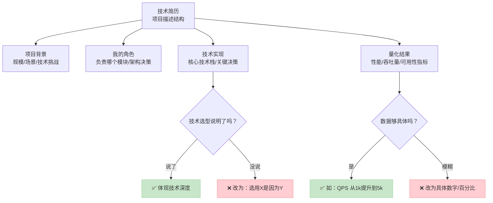

# 程序员简历怎么写：技术岗简历的完整模板与避坑指南

> 本文是写给程序员、软件工程师等所有技术求职者的深度简历写作指南。它解决了技术简历“项目经历写不深、技术栈描述不清、成果量化不够”三大核心痛点。无论你是应届生还是资深工程师，都能获得从结构到细节、附带完整示例的实操方案。

一份合格的技术简历，必须让面试官在30秒内看清你的技术栈、项目角色和核心产出。而一份优秀的简历，则能引导面试官追问你感兴趣的领域，从而掌控面试节奏。本文将拆解后端、前端、算法三个方向的简历写法，并提供可直接套用的模板和避坑清单。

## 一、技术简历的核心：如何写出有深度的项目经历

项目经历是技术简历的灵魂，但大多数程序员止步于功能罗列。真正的深度来源于**技术决策的阐述**和**量化结果的证明**。

一个高质量的项目描述，应该遵循以下结构，它回答了面试官最关心的四个问题：



上图清晰地展示了优秀项目描述的构成要素与自查要点。下面我们看一个反面案例和修改后的正面案例。

**改前 vs 改后案例（后端开发岗）：**

> **改前（模糊、无深度）：**
> - 负责用户中心模块开发。
> - 使用Spring Boot和MySQL。
> - 优化了接口性能，解决了系统卡顿问题。
> - 参与了代码Review。

> **改后（具体、有决策、有量化）：**
> - **项目背景**：支撑千万级用户的电商平台，旧用户中心接口响应慢（平均>500ms），且扩展性差。
> - **我的角色**：独立负责用户中心服务重构的架构设计与核心开发（登录、鉴权、个人信息模块）。
> - **技术实现**：
>   - 选用 **Spring Boot + JWT** 重构鉴权流程，替代旧Session方案，实现无状态化以支持水平扩展。
>   - 引入 **Redis集群** 缓存用户高频查询数据（如个人资料），将缓存穿透率从15%降至1%以下。
>   - 对核心查询接口进行**SQL优化与索引重建**，并利用**异步编排**（CompletableFuture）聚合多个下游数据。
> - **量化结果**：
>   - 核心接口平均响应时间从 **520ms 降至 85ms**（提升 **84%**），P99从1.2s降至200ms。
>   - 服务QPS承载能力从 **1,200 提升至 8,000+**。
>   - 通过设计清晰的API与模块边界，使后续新增用户属性功能的开发周期缩短了40%。

修改后的描述，不仅说明了“做了什么”，更解释了“为什么这么做”以及“带来了什么可衡量的价值”，这正是技术深度的体现。

### Q: 项目经历很多，如何选择和排序？

A: 遵循“相关性 > 技术深度 > 项目规模”原则。
1.  **相关性优先**：将与目标岗位技术栈最匹配、业务领域最相关的项目放在最前面。
2.  **展示深度**：哪怕是一个校内项目，如果能深入阐述技术难点和优化过程，也比一个你只写了简单CRUD的大厂项目更有价值。
3.  **倒序排列**：通常按时间倒序排列，但如果你早期有一个极其亮眼且相关的项目，可以适当提前。
4.  **数量控制**：资深工程师（5年+）精选3-4个最具代表性的项目；初级工程师（0-3年）可写2-3个，确保每个都能展开细节。对于校招生，高质量的课程设计、实习经历、开源贡献或竞赛项目都是绝佳素材。

## 二、技术栈描述：从罗列清单到体现熟练度

简单地罗列“Java, MySQL, Redis”是无效信息。你需要通过描述方式和项目佐证来体现掌握程度。

**错误的写法：**
```
技能：Python, TensorFlow, PyTorch, Spark, Hadoop, Docker, Kubernetes, AWS...
```
（像在堆砌关键词，无法判断真实水平）

**正确的写法（分层级、有佐证）：**
```
**精通**：
- Python：3年核心开发经验，熟悉asyncio并发编程、元类等高级特性，在[A项目]中用于开发高性能数据管道。
- PyTorch：深入理解自动求导与动态图机制，在[B项目]中实现了XXX模型，精度达到SOTA。

**熟练**：
- Docker & Kubernetes：有生产环境容器化部署经验，在[C项目]中编写了Dockerfile与Helm Chart，实现服务一键部署。
- AWS (EC2, S3, RDS)：曾使用Terraform进行基础设施编排。

**了解**：
- Spark, Hadoop：了解其生态与基本原理，有过读源码和本地测试的经验。
```
**要点：**
- 使用“精通”、“熟练”、“了解”等词汇区分掌握程度，务必诚实。
- 在“精通”和“熟练”的技能后，最好能括号备注在哪个项目中使用过，增加可信度。
- 将技能分类，如“编程语言”、“后端框架”、“数据库”、“云服务/ DevOps”、“前端/移动端”等，让结构更清晰。

## 三、不同技术方向的简历侧重点与示例

### 1. 后端开发简历：突出架构、性能与系统思维
后端简历的核心是**高并发、高可用、数据一致性**。面试官希望看到你处理复杂业务逻辑和保障系统稳定的能力。

**必备模块：**
- **技术栈**：清晰列出语言、框架、中间件、数据库、运维工具链。
- **项目经历**：重点描述你设计的**架构**、解决的**性能瓶颈**、保证的**数据一致性**方案（如分布式事务）。
- **成果量化**：必须包含**响应时间（RT）、吞吐量（QPS/TPS）、可用性（SLA）、资源成本（CPU/内存节省）** 等数据。

**示例片段（资深Java后端）：**
```
**XX支付系统核心交易链路优化 | 2023.03 - 至今**
- **背景**：大促期间支付成功率波动，核心交易接口P99延时达800ms。
- **角色**：作为核心成员，负责交易下单与支付流程的性能优化与稳定性保障。
- **实现**：
  1. **链路梳理与热点拆分**：通过全链路压测与Arthas诊断，将商品库存校验等热点查询从交易主链路剥离，改为**异步预扣+最终同步**。
  2. **数据库优化**：对订单表进行**水平分库分表（ShardingSphere）**，并针对支付状态查询建立复合索引，使相关查询效率提升20倍。
  3. **缓存策略升级**：将本地缓存（Caffeine）与分布式缓存（Redis）结合，设计**两级缓存降级方案**，确保缓存失效时数据库不被击穿。
- **结果**：
  - 支付核心链路P99延时从 **800ms 稳定至 150ms** 以下。
  - 大促期间系统支付成功率从 **99.2% 提升至 99.95%**。
  - 数据库CPU峰值负载下降 **35%**。
```

### 2. 前端开发简历：突出用户体验、工程化与跨端能力
前端简历的核心是**用户体验、工程效率和跨平台/端一致性**。要展现你不只是写页面，更是解决问题的工程师。

**必备模块：**
- **技术栈**：区分框架（React/Vue）、工程化（Webpack/Vite）、语言（TS）、跨端（React Native/Flutter/小程序）。
- **项目经历**：重点描述**性能优化**（首屏加载、渲染帧率）、**工程化建设**（CI/CD、组件库、Monorepo）、**复杂交互实现**或**跨端方案**。
- **成果量化**：**页面加载速度（FCP, LCP）、打包体积减少、构建时间缩短、UI组件复用率、Bug率下降**等。

**示例片段（高级前端工程师）：**
```
**B端SaaS平台前端架构升级 | 2022.10 - 2023.06**
- **背景**：老项目技术栈陈旧（Backbone.js），代码维护难，页面加载缓慢（平均LCP>4s）。
- **角色**：主导前端技术选型与架构重构，并负责核心模块开发。
- **实现**：
  1. **技术栈升级**：主导迁移至 **React 18 + TypeScript**，引入Vite替换Webpack，配置**模块联邦（Module Federation）** 实现微前端基座。
  2. **性能优化**：实施**路由懒加载**、**图片资源CDN化与懒加载**、并利用**React.memo**与`useMemo`优化大型数据表格渲染。
  3. **工程化提效**：搭建**私有NPM registry**，将通用组件与工具函数封装为独立包；制定ESLint/Prettier规范与Git Hooks，统一代码风格。
- **结果**：
  - 应用平均**首屏加载时间（LCP）从 4.2s 缩短至 1.1s**（提升74%）。
  - 生产环境构建时间从 **12分钟减少至 90秒**。
  - 通过搭建的**通用表格组件库**，使类似业务页面的开发效率提升约50%。
```

### 3. 算法工程师简历：突出问题定义、模型创新与业务贡献
算法简历的核心是**将业务问题转化为数学模型，并用数据证明解决方案的有效性**。切忌只罗列模型名称。

**必备模块：**
- **技术栈**：清晰列出**研究方向**（CV/NLP/推荐/风控）、**掌握模型**、**数据处理工具**、**编程与深度学习框架**。
- **项目经历**：必须遵循“**业务问题 -> 数据分析 -> 方案选型与创新 -> 实验设计 -> 线上效果**”的逻辑链。
- **成果量化**：必须包含**核心指标提升（AUC/GAUC，Recall，Precision，业务指标如CTR/GMV）**、**效率提升（推理耗时下降）**、**影响范围（覆盖用户/流量）**。

**示例片段（推荐算法岗）：**
```
**电商首页推荐流算法优化 | 2023.01 - 2023.08**
- **背景**：首页推荐流同质化严重，用户停留时长与GMV转化增长乏力。
- **角色**：独立负责召回与粗排阶段的算法模型迭代。
- **实现**：
  1. **问题分析**：通过归因分析发现，原有双塔模型对**用户实时兴趣**与**商品多样性**捕捉不足。
  2. **模型迭代**：
     - **召回层**：在双塔模型基础上，引入用户**实时点击序列**作为额外特征，通过Transformer编码，构建 **“实时兴趣”向量**。
     - **粗排层**：设计 **MMoE多任务模型**，同时优化点击率（CTR）与停留时长，并加入**多样性正则项**，平衡效率与探索。
  3. **实验**：设计A/B Test，实验组流量占比10%，持续观察两周。
- **结果**：
  - 线上A/B Test显示，新模型使推荐流**人均停留时长提升 15%**，**GMV贡献提升 8.5%**。
  - 召回模型线上服务**P99延迟仅增加 5ms**，在可接受范围内。
  - 项目成果已全量上线，覆盖**所有日活用户**。
```

### Q: 我没有上线项目或业务成果，作为学生/初学者如何写项目？

A: 聚焦于**技术实现细节、优化过程和学习能力**。
1.  **课程/个人项目**：详细描述技术选型原因、遇到的bug（如内存泄漏、并发问题）及你如何调试解决的过程。
2.  **复现经典论文/模型**：说明复现的动机、与原作的差异、你做的优化（如训练技巧、代码重构）以及最终达到的精度。
3.  **参与开源项目**：这是黄金履历。明确写出你**贡献的PR链接**、解决了什么Issue、代码被合并到了哪个版本。例如：“为Apache项目XXX修复了内存泄漏bug（PR #1234），该修复已被合并至v2.1.0版本。”
4.  **竞赛成绩**：写出竞赛名称、排名（如Top 5%）、使用的核心方法，这证明了你在特定问题上的技术实力。

## 四、程序员简历的完整结构与避坑清单

一份标准的技术简历应包含以下模块，并按此顺序排列：

1.  **基本信息**：姓名、电话、邮箱、GitHub/技术博客链接（**非常重要！**）、求职意向。
2.  **教育背景**：学校、专业、学历、时间。硕士以上可写研究方向，成绩优异（如前10%）可写GPA。
3.  **工作/实习经历**（或**项目经历**）：按时间倒序排列，使用上文所述的结构化方法描述。
4.  **技术技能**：分层分类清晰列出。
5.  **开源贡献/竞赛获奖**（如有）：单独列出，是巨大加分项。
6.  **个人总结/附加信息**（可选）：可简单写一两句技术热情或职业目标，但切忌空话套话。

**程序员简历终极避坑检查清单（投递前逐项核对）：**

- [ ] **格式**：是否使用**单栏、简洁、黑白**的PDF格式？ATS系统可能无法正确解析复杂的排版和双栏布局。
- [ ] **长度**：是否控制在**1-2页**？资深工程师不超过2页，应届生1页为佳。
- [ ] **关键词**：是否涵盖了目标职位JD中提到的**关键技术栈和工具**？（但不要虚假编写）
- [ ] **量化**：每一个项目描述下，是否都包含了**至少一个可量化的成果**（数字、百分比）？
- [ ] **动词开头**：项目描述是否全部使用**强有力的过去时态动词**（如“设计”、“实现”、“优化”、“提升”）开头？
- [ ] **技术细节**：是否避免了“参与”、“了解”等模糊词汇，转而描述具体的技术动作和决策？
- [ ] **链接有效**：你的**GitHub链接是否有效**？主页是否有README？简历中提到的项目是否在仓库中有清晰代码？
- [ ] **无错别字**：是否仔细检查了**技术名词的拼写**（如“Redis”不是“Redies”）和语法错误？可以让朋友或工具帮忙检查。
- [ ] **文件命名**：PDF文件名是否为 **`姓名-岗位-电话.pdf`** 等专业格式，而非“新建文档.pdf”？
- [ ] **ATS兼容性**：你可以使用超级简历的ATS匹配检测功能，来快速检查简历的机器可读性和关键词覆盖度，确保它能通过初筛。

参考阅读：[校招简历投递必看：Offer收割机都在做的3个验证步骤 | 超级简历WonderCV](https://wondercv.com)

## 五、可直接复制的简历内容模板（后端开发方向）

将以下模板中的 `[]` 替换为你自己的信息，并按照前文方法填充细节。

```markdown
# [你的姓名]
[电话] | [邮箱] | [GitHub链接] | [技术博客/个人网站]（可选）

## 教育背景
[大学名称]， [专业]
[学位] | [入学时间] - [毕业时间]
（可选：GPA: [分数]/4.0，排名：[排名] | 相关课程：[列出2-3门核心课程]）

## 工作经历 / 项目经历

### [公司/项目名称] | [岗位] | [时间]
**项目背景**：[一句话说明项目的业务目标、规模或面临的技术挑战]
**我的角色**：[明确你在项目中的职责和负责的模块]
**技术实现与贡献**：
  - [贡献点一：采用XX技术/架构，解决了XX问题。例如：使用微服务架构拆分单体应用，定义了服务边界与API契约。]
  - [贡献点二：针对XX性能瓶颈，做了XX优化。例如：通过Redis缓存热点数据与异步处理，将接口QPS从A提升至B。]
  - [贡献点三：负责了XX技术难点攻关。例如：基于分布式锁与消息队列实现了最终一致性的订单库存扣减方案。]
**项目成果**：
  - [量化结果一：系统性能提升，如响应时间降低X%，吞吐量提升Y倍。]
  - [量化结果二：业务指标改善，如错误率降低，可用性提升。]
  - [量化结果三：开发效率或资源利用率提升。]

（重复以上结构，描述2-3个核心项目）

## 技术技能
**编程语言**：精通[Java]，熟练[Go/Python]，了解[C++]
**后端框架**：精通[Spring Boot/Cloud]，熟练[Gin/Django]
**数据库**：熟练[MySQL（索引、事务）]， [Redis（数据结构、持久化）]，了解[MongoDB]
**中间件**：熟练[RocketMQ/Kafka]， [Nginx]， [Elasticsearch]
**云原生与DevOps**：熟练[Docker， Kubernetes]，了解[CI/CD (Jenkins/GitLab CI)， AWS/Aliyun]
**其他**：[Git]， [Linux]， 良好的数据结构与算法基础

## 开源贡献
（如有）
- [项目名]：提交了关于[具体贡献]的PR（#链接），已被合并。

## 获奖情况
（如有，尤其算法竞赛、编程比赛）
- [比赛名称]， [奖项]， [时间]
```

---

## 相关资源

- [超级简历 WonderCV](https://wondercv.com) — ATS 友好简历模板库，AI 优化建议，一键导出 PDF
- [中文简历模板库](https://github.com/WonderCV-com/resume-templates) — 100+ 岗位专属模板
- [AI 求职工具合集](https://github.com/WonderCV-com/resume-skills-and-tools) — 提示词库与求职工作流
- [更多求职指南](https://github.com/WonderCV-com/resume-guide) — 简历写法 · 面试技巧 · 岗位攻略

> 本文由 WonderCV 内容团队出品，已帮助 **500 万+** 求职者。