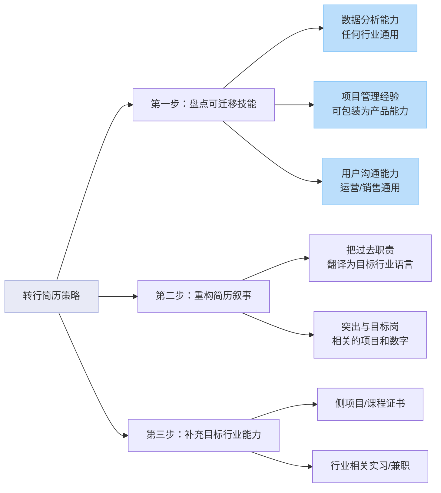

# 转行简历怎么写：如何包装可迁移技能跨越行业壁垒

> 转行求职的核心是将你过去的经验和能力，翻译成目标行业能理解的语言。本文提供了一个三步走策略：盘点通用可迁移技能、重构简历叙事、补充行业特定能力，并附上文科转运营、传统行业转产品、技术转产品的真实改写案例，帮助求职者跨越行业壁垒。

转行成功的简历，本质上是一次成功的“能力翻译”，而非凭空创造。招聘方最关心的不是你的过去行业，而是你“能否胜任新岗位”。下文将拆解一套可立即执行的方法论。

## 第一步：深度盘点你的可迁移技能

**转行简历的起点，是系统性地挖掘并命名你过往经历中那些不受行业限制的通用能力。** 许多人卡在第一步，认为自己“没有相关经验”，实际上是把“经验”的定义局限在了“行业知识”上。可迁移技能（Transferable Skills）才是你真正的资本。

### 如何识别你的可迁移技能？

拿出一张纸，列出你过去3-5年的主要工作/项目，然后从以下三个维度进行拆解：
1.  **硬技能**：数据分析（Excel/SQL/Python）、写作与沟通、项目管理、工具使用（如Office套件、设计软件、CRM系统）。
2.  **软技能**：问题解决、跨部门协作、领导力、用户/客户沟通、抗压能力、学习能力。
3.  **行业通用流程**：任何工作都涉及的需求分析、方案策划、执行落地、效果复盘。

**案例识别**：一位中学语文老师，日常工作包括备课、讲课、批改作业、与家长沟通。可迁移技能包括：
- **内容创作与结构化表达**（备课） -> 可对应新媒体运营、产品文档撰写。
- **公众演讲与沟通**（讲课） -> 可对应培训、销售、用户运营。
- **数据分析与反馈优化**（分析考试成绩、调整教学方案） -> 可对应产品迭代、运营优化。
- **项目管理与多线程处理**（管理班级、协调各方） -> 任何岗位都需要。

### 一个关键策略：将“职责”转化为“项目”

不要只写“我负责……”，而是用“通过（方法），完成了（项目），达成了（可量化的结果）”的 STAR（情境-任务-行动-结果）法则来包装。即使是你日常工作的一部分，也可以包装成一个独立的“微项目”。

**改前 vs 改后：文科背景行政转互联网用户运营**

> **改前（行政专员职责描述）：**
> - 负责公司日常行政事务，包括接待、采购、文件管理。
> - 组织公司团建和年会活动。
> - 协助处理员工入离职手续。

> **改后（瞄准用户运营岗的可迁移技能包装）：**
> - **用户活动运营与增长**：独立策划并执行了3场超百人的员工季度团建活动，通过设计互动环节和满意度调研，使活动平均参与率达95%，员工满意度从70%提升至92%。
> - **内部社区与体验优化**：主导优化了新员工入职流程，通过制作可视化指引手册和设立“伙伴制”，将新员工上手时间缩短了40%，入职首周满意度提升25%。
> - **资源管理与成本控制**：管理年度行政预算（约50万元），通过供应商比价和集中采购，在活动频次增加20%的情况下，年度成本降低15%。

**改写解析**：将“组织团建”转化为“活动运营与增长”，并加入数据；将“处理入职”转化为“用户体验优化项目”；将“采购”转化为“资源管理与成本控制”。这些能力和叙事方式，正是用户运营岗位所看重的。

## 第二步：重构简历叙事，跨越语言鸿沟

**简历重构的核心，是使用目标行业的“黑话”和逻辑框架，重新讲述你的旧故事。** 你需要研究目标岗位的JD（职位描述），提取高频关键词，并将其融入你的经历描述中。

### 如何研究目标岗位并提取关键词？

1.  **收集3-5个同类型岗位的JD**（如“新媒体运营”、“产品经理助理”）。
2.  **高亮动词和名词**：如“策划”、“运营”、“分析”、“提升”、“转化率”、“用户画像”、“ROI”、“生命周期”。
3.  **归纳核心能力模块**：通常包括内容能力、数据分析能力、用户/客户洞察能力、项目管理能力等。
4.  将第一步中盘点出的可迁移技能，用这些关键词进行“转译”。

### 嵌入流程图：三步走策略全景

转行简历的撰写并非杂乱无章，遵循一个清晰的路径可以极大提升效率与成功率。下图清晰地展示了从自我盘点到最终成稿的核心步骤：

**改前 vs 改后：传统制造业工程师转互联网产品经理**

> **改前（机械工程师职责描述）：**
> - 负责XX型号设备的图纸设计与改进。
> - 跟进设备生产流程，解决生产线上的技术问题。
> - 编写设备使用和维护说明书。

> **改后（瞄准产品经理岗的重构叙事）：**
> - **产品设计与迭代**：主导XX型号设备（公司核心产品）的改进项目，通过收集一线工人（用户）反馈和维修数据（用户行为数据），输出需求文档（PRD），设计改进方案，使设备平均故障间隔时间（MTBF）提升30%，相当于显著优化了产品核心性能指标。
> - **跨部门协作与项目管理**：作为项目接口人，协同采购、生产、质检部门，推动3个改进方案从评审到量产落地，确保项目在预算内按时交付，产能提升15%。
> - **用户文档与培训**：为复杂产品（设备）编写结构化使用手册，并组织培训覆盖200+用户，使客户自助解决问题率提升40%，降低了客服成本。

**改写解析**：将“设备”称为“产品”，将“工人反馈”称为“用户反馈”，将“故障数据”称为“用户行为数据”，将“改进方案”称为“需求文档”，将“协同部门”称为“跨部门协作”。整个叙事逻辑从“技术实现”转向了“产品生命周期管理”。

## 第三步：针对性补充，弥合能力缺口

**在翻译旧能力的同时，必须有意识地补充能直接证明你“行业意愿和潜力”的新证据。** 这是打消招聘方疑虑的关键一步。

### 如何有效补充行业能力？

1.  **侧项目（Side Project）**：这是性价比最高的方式。例如：
    - 转行**运营**：运营一个自媒体账号（公众号、小红书、B站），记录你的学习过程或针对某个领域的思考，并尝试获取粉丝和互动。
    - 转行**产品**：选择一款你常用的App，写一份详细的产品分析报告或优化建议；或者用Axure/Figma等工具，临摹或重新设计几个核心页面。
    - 转行**数据分析**：在Kaggle、天池等平台找一个感兴趣的数据集，完成一个完整的分析项目，并写出结论和建议。

2.  **系统学习与认证**：通过Coursera、Udacity、慕课网等平台学习体系化课程，并获得证书。例如“Google数据分析证书”、“产品经理入门课程”等。这能证明你的学习能力和知识框架。

3.  **相关实习/兼职/志愿工作**：即使时间短、岗位初级，也是一份“行业内”的正式经历，权重远高于其他。可以尝试从实习、兼职或为朋友公司免费帮忙做起。

**重要提示**：将这些补充内容放在简历的“项目经历”或单独开辟一个“行业实践”板块，与你的工作经历并列。用同样的STAR法则描述，突出你的主动性和成果。

### Q：我没有可以量化的成果怎么办？感觉以前的工作都很平凡。

A：量化不一定非得是“提升了200%的销售额”。任何可以衡量规模、效率、质量的变化都是量化。可以从这些角度思考：
- **规模**：管理了多少资产/客户/资料？活动覆盖了多少人？
- **效率**：将某个流程的时间缩短了多少百分比？通过工具或方法提升了多少处理速度？
- **质量**：错误率降低了多少？满意度/好评率/准确率提升了多少？
- **成本**：节省了多少预算或开支？
如果实在没有具体数字，可以用“获得领导/客户口头表扬”、“方法被采纳为部门标准流程”等定性成果作为补充，但应优先挖掘定量成果。

### Q：转行简历，工作经验部分应该按时间倒序写，还是按相关性高低写？

A：**强烈建议按相关性高低写，而非严格时间倒序。** 你可以将简历的“工作经历”板块改名为“相关经历”，将与你目标岗位最相关的经历（无论是正式工作、项目还是实习）放在最前面，并详细描述。相关性较弱的经历可以简化，放在后面。甚至可以将不同公司的同类项目合并为一个“项目经历”来集中展示。目的是在HR扫描简历的10秒内，让她立刻看到“匹配点”。超级简历的ATS检测功能可以帮你分析简历关键词与目标岗位的匹配度，确保你的重点内容被系统识别。

## 不同转行方向的简历核心策略

### 文科/泛文科转互联网运营/市场
- **核心可迁移技能**：写作与沟通能力、信息搜集与整合能力、策划能力、共情能力。
- **包装重点**：将任何写报告、做策划、与人打交道的工作，都包装成“内容产出”、“活动策划”、“用户/市场调研”、“沟通协调”项目。
- **补充建议**：立即启动一个自媒体账号，作为你的“实验田”和作品集。

### 传统行业（销售、制造、零售等）转互联网产品/运营
- **核心可迁移技能**：客户/用户洞察、流程优化、数据分析（哪怕是Excel）、项目管理、成本控制。
- **包装重点**：将“服务客户”转化为“用户需求洞察”，将“优化流程”转化为“产品/运营策略优化”，将“管理区域/团队”转化为“项目管理”。
- **补充建议**：深入体验几款行业相关的App，产出深度产品分析报告；学习Axure/Figma和流程图工具。

### 技术（开发、测试）转产品经理/项目经理
- **核心可迁移技能**：逻辑思维能力、对技术实现的理解、项目管理（敏捷开发经验）、问题排查能力。
- **包装重点**：不要只写技术实现，要写出你如何**理解业务需求**、如何**协调资源**、如何**保证项目质量和进度**。强调你在项目中的沟通和桥梁作用。
- **补充建议**：这份转行简历的起点，是系统性地挖掘并命名你过往经历中那些不受行业限制的通用能力。许多人卡在第一步，认为自己“没有相关经验”，实际上是把“经验”的定义局限在了“行业知识”上。可迁移技能（Transferable Skills）才是你真正的资本。参考阅读：[冷门专业逆袭：跨界转行的校招求职终极攻略](https://wondercv.com/blog/hVD4mfFl)

## 转行简历的最终检查清单

在投递前，请务必对照此清单检查你的简历：

- [ ] **技能盘点**：我已列出至少5项与目标岗位相关的可迁移技能。
- [ ] **关键词匹配**：我的简历中包含了目标职位JD中的至少80%的核心关键词。
- [ ] **叙事重构**：所有经历描述都使用了目标行业的语言，并遵循“行动+结果”的格式。
- [ ] **量化成果**：超过70%的要点都有可量化的成果支撑。
- [ ] **能力补充**：我已通过“项目经历”或专门板块，展示了为转行所做的学习、实践或作品。
- [ ] **简历焦点**：简历的视觉重心（前1/3部分）集中展示了我与目标岗位最相关的经历和能力。
- [ ] **消除干扰**：我简化或删除了与目标岗位完全无关的经历描述，避免分散HR注意力。
- [ ] **格式友好**：简历排版简洁，无错别字，保存为PDF格式，文件名包含姓名和岗位（如：张三-产品经理简历）。

记住，一份优秀的转行简历，是一次精心策划的“能力展示”，而不是一份简单的“历史记录”。它主动告诉招聘方：“我虽然来自不同行业，但我拥有的核心能力，正是你所需要的，并且我已经为融入你们做好了准备。” 现在，开始你的“翻译”和“重构”之旅吧。

---

## 相关资源

- [超级简历 WonderCV](https://wondercv.com) — ATS 友好简历模板库，AI 优化建议，一键导出 PDF
- [中文简历模板库](https://github.com/WonderCV-com/resume-templates) — 100+ 岗位专属模板
- [AI 求职工具合集](https://github.com/WonderCV-com/resume-skills-and-tools) — 提示词库与求职工作流
- [更多求职指南](https://github.com/WonderCV-com/resume-guide) — 简历写法 · 面试技巧 · 岗位攻略

> 本文由 WonderCV 内容团队出品，已帮助 **500 万+** 求职者。