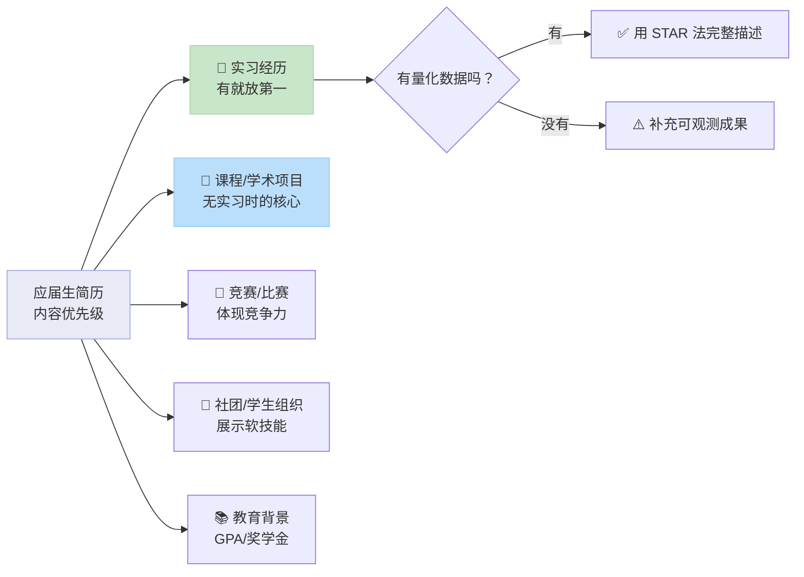

# 应届生简历怎么写：没有工作经验也能突出实力

> 本文为应届毕业生提供一套完整的简历写作策略，核心解决“缺乏工作经验”的求职难题。通过优先级排序和内容转化技巧，将实习、课程项目、竞赛、社团等校园经历转化为HR认可的职场能力。适用于所有参加校招的大学生，特别是985/双非背景的同学。

面对校招，最大的焦虑往往是简历上“空空如也”的工作经验栏。但这恰恰是应届生的常态，而非劣势。关键在于，你需要一套方法，将校园里积累的潜力，转化为简历上看得见的实力。本文将提供一套从内容优先级到具体写作技巧的完整方案，让你即使没有全职经验，也能打造出一份让HR眼前一亮的简历。

## 一、内容优先级：没有工作经验，先写什么？

很多同学一打开简历模板就犯愁：教育背景之后，该写什么？答案是：遵循一个清晰的优先级顺序。这决定了HR阅读你简历时的第一印象和兴趣度。

下图清晰地展示了应届生简历内容的优先级策略，你可以据此规划你的简历模块顺序：



**核心结论：实习经历永远是第一优先级，如果没有，就用高质量的课程项目或学术研究填补。**

- **实习经历 (🥇)**：哪怕只有1-2个月，也是离职场最近的经历。应置于“教育背景”之后的第一位。
- **课程/学术项目 (🥈)**：这是绝大多数同学都拥有的“宝藏”。一个完整的课程设计、毕业论文、小组课题，其过程（调研、分析、协作、产出）与职场项目高度相似。
- **竞赛/比赛 (🥉)**：获奖经历是硬实力的证明，尤其是国家级、省级奖项。未获奖但有亮眼过程的参赛经历也可写。
- **社团/学生组织 (🏅)**：重点在于你担任的角色和组织的活动，用以展示沟通、策划、领导等软技能。
- **教育背景 (📚)**：除了学校专业，高GPA、排名、奖学金是重要的量化补充。

**Q: 如果我的实习很“水”，比如只是在公司打杂，该怎么写？**

**A:** 关键在于**视角转换**。不要写“负责打印文件、整理资料”，而是挖掘这些“杂事”背后的目的和你的贡献。例如：
- **改前（打杂视角）**：
  > 协助部门日常事务，包括文件归档、会议记录和资料整理。

- **改后（价值视角）**：
  > 参与XX项目资料库的建立与维护，通过系统化归档300+份项目文件，支持团队将平均资料检索时间从15分钟缩短至3分钟，提升了项目协作效率。

即使没有直接数据，也可以描述**可观测的成果**，如“建立了XX流程”、“优化了XX方法”、“获得了同事/导师的正面反馈”。参考阅读：[简历优化：如何巧妙处理家族企业实习经历，提升竞争力？](https://wondercv.com/blog/ttOatT8k) 学习如何提炼通用技能。

## 二、核心转化技巧：用STAR法则将“经历”变成“经验”

知道写什么之后，更重要的是怎么写。STAR法则（情境-Situation，任务-Task，行动-Action，结果-Result）是将任何一段校园经历结构化、专业化呈现的黄金框架。

**核心结论：描述任何经历时，必须包含你面临的具体任务、你采取的具体行动、以及行动带来的具体结果（数据优先）。**

### 案例一：将课程项目转化为“产品分析经验”（适用于互联网/市场岗位）

假设你是一名市场营销专业的学生，完成了一个《某短视频APP用户画像分析》的课程作业。

- **改前（平淡描述）**：
  > 参与《短视频APP分析》课程项目，学习了用户分析的方法。

- **改后（STAR法则描述）**：
  > **项目：某头部短视频APP年轻用户画像与增长策略分析**
  > **情境(S):** 课程要求基于真实数据完成一份行业分析报告，以评估市场机会。
  > **任务(T):** 独立负责从0到1构建18-24岁核心用户群体的完整画像，并提出可行的用户增长建议。
  > **行动(A):** 1) 爬取并清洗了公开的5000条用户评论数据，进行情感与主题分析；2) 设计了线上问卷，收集了200份目标用户样本，分析其使用时长、内容偏好及痛点；3) 使用Excel与SPSS进行交叉分析，提炼出“社交焦虑缓解”、“碎片化知识获取”两大核心需求。
  > **结果(R):** 1) 产出的20页分析报告被教授评为“A+”级优秀作业；2) 基于分析提出的“创建‘知识胶囊’专题频道”建议，在后续的模拟商业策划比赛中被采纳，并帮助团队获得第二名。

这个改写将一次作业升级为一个完整的“市场研究项目”，展示了数据获取、分析、洞察和策略建议的全流程能力。

### 案例二：将社团活动转化为“活动运营经验”（适用于运营、行政岗位）

假设你曾是学生会外联部的干事，参与组织了一次校园歌手大赛。

- **改前（罗列职责）**：
  > 担任外联部干事，负责联系赞助商和布置活动现场。

- **改后（STAR法则描述）**：
  > **经历：学生会外联部干事 - 第十届校园歌手大赛**
  > **情境(S):** 年度大型校园活动预算有限，需通过外部赞助覆盖大部分成本。
  > **任务(T):** 独立负责为活动争取不少于3000元的现金或物资赞助。
  > **行动(A):** 1) 筛选并锁定周边5家与学生消费相关的新开业商户（奶茶店、眼镜店、打印店）为目标；2) 撰写并迭代了3版赞助方案，突出活动能为商户带来的品牌曝光与精准客流；3) 进行线下拜访与谈判，针对不同商户需求定制赞助权益（如现场摊位、奖品冠名）。
  > **结果(R):** 成功与3家商户达成合作，获得总计3800元赞助（现金2000元+物资1800元），超额完成目标27%，保障了活动顺利举办。

这个改写展示了你的商务拓展、方案撰写、谈判沟通和结果导向的能力。

**写作时请使用以下可复制的STAR描述模板：**

```markdown
**项目/经历名称：**[具体名称]
- **情境 (S):** [当时面临的背景、挑战或机会]
- **任务 (T):** [你需要完成的具体目标或职责]
- **行动 (A):** [你采取的1、2、3...具体步骤和方法]
- **结果 (R):** [产生的量化数据（首选）、可观测成果、或获得的认可]
```

**Q: 我的项目结果没有硬数据，比如没获奖、没量化指标，怎么办？**

**A:** 可以聚焦于**过程产出**和**个人成长**。例如：
- “独立完成了XX模块的代码/设计/报告，该部分被教授/组长评价为‘逻辑最清晰’。”
- “通过主导每周小组会议和进度跟踪，确保了项目在截止日期前交付，团队协作效率提升。”
- “研究过程中掌握了XX软件/分析方法（如Python数据清洗、SWOT分析），并应用于最终产出。”
结果可以是“学会了什么”、“提升了什么”、“获得了什么正面反馈”。更多内容见 [优秀大学生个人简历范文参考，帮你写好大学生简历](https://wondercv.com/blog/v045qohb)。

## 三、针对不同学校背景的策略：985与双非如何各显神通

学校背景是客观事实，但简历策略可以主观优化。关键在于**扬长避短，差异化突出**。

**核心结论：985学生应深化“专业深度”与“研究潜力”，双非学生应强化“实践执行力”与“技能匹配度”。**

### 985/重点高校学生策略：
1.  **突出学术权重**：将高质量的课程项目、毕业论文、跟随导师的科研课题放在显眼位置。详细描述研究方法和结论。
2.  **利用平台资源**：提及参与的“国家级大学生创新计划”、“名校公开合作项目”等，凸显平台优势。
3.  **展示思维深度**：在描述经历时，多使用“通过XX模型分析”、“基于XX理论框架”、“论证了XX假设”等体现学术素养的语言。
4.  **示例（教育背景增强）**：
    > **北京大学 | 计算机科学与技术 | GPA 3.8/4.0 (专业排名前10%)**
    > - **核心课程:** 算法设计（A+）、机器学习（A）、数据库系统（A）
    > - **科研助理:** 参与国家自然科学基金项目《XX算法优化》，负责数据仿真模块。

### 双非/普通高校学生策略：
1.  **极致强化实践**：将实习、项目、竞赛经历写得无比扎实和具体，用详尽的STAR描述证明你的动手能力和产出能力。
2.  **精准技能匹配**：深入研究目标岗位的招聘要求（JD），将你的技能和经历**逐条对齐**。例如JD要求“熟练使用Excel进行数据分析”，你就必须在项目描述中明确写出“使用Excel函数与透视表，处理了XX数据，得出XX结论”。
3.  **凸显主动性与成长**：强调你如何**主动获取**了某些经历。例如：“通过自学Python及参与线上数据分析竞赛，在无学校相关课程的情况下，掌握了数据处理技能。”
4.  **示例（技能精准匹配）**：
    > **目标岗位：新媒体运营（要求：文案、排版、数据分析）**
    > - **技能部分:** 文案撰写（独立运营个人公众号，产出30+篇原创）、图文排版（熟练使用Canva、秀米）、基础数据分析（使用公众号后台数据优化选题）。
    > - **项目部分:** “个人公众号‘XX杂谈’运营项目”——详细描述你如何根据每周阅读数据调整内容方向，使平均阅读量从100提升至500。

超级简历的ATS检测功能可以帮助你检查简历中的关键词是否与岗位要求匹配，这是一个实用的优化工具。

## 四、简历模块填写指南与避坑清单

一份专业的简历不仅在内容上出色，在形式与细节上也需无可挑剔。以下是各模块的填写指南和一个必须遵守的避坑清单。

### 1. 教育背景：不止于学校专业
- **必须包含：** 学校、专业、学历、时间。
- **亮点补充：** 高GPA（如3.5/4.0以上）、高排名（如前10%）、重要奖学金（国家、校级）、核心高分课程（与求职岗位相关）。
- **可选补充：** 主修课程（若专业与岗位不完全对口，可选修相关课程列出）、海外交流经历。

### 2. 经历描述：永远追求量化与具体
- **动词开头：** 使用“负责”、“主导”、“参与”、“协助”等明确角色动词。
- **避免空洞：** 杜绝“锻炼了能力”、“提升了水平”等模糊表达。
- **数据为王：** 百分比、数量、金额、排名、时间缩短量等都是黄金数据。
- **格式统一：** 时间格式建议使用“YYYY.MM - YYYY.MM”，避免中英文混杂。参考阅读：[校招简历日期格式避坑指南：HR最看重的细节，助你提升20%通过率](https://wondercv.com/blog/e4jamx1h)。

### 3. 技能与证书：分门别类，清晰呈现
- **分类列出：** 分为“专业技能”（Python, SQL, Photoshop）、“语言技能”（英语CET-6）、“办公技能”（Excel高级函数）等。
- **证书价值：** 优先列出与职业强相关的（如CPA、PMP），对于像“驾照”这类证书，除非岗位特殊要求，否则不必列出。

### 4. 自我评价/个人总结：点睛而非凑数
- 此部分不是必写项。如果写，应是对简历精华的**高度概括**，而非重复或喊口号。
- **优秀范例：** “具备扎实的数据分析理论基础（GPA 3.9）与丰富的实践应用能力（独立完成3个数据分析项目，其中1个获省级奖项）。对互联网行业充满热情，善于通过数据洞察用户需求。”
- **避坑范例：** “本人性格开朗，学习能力强，乐于接受新挑战，希望得到一个工作机会。” （过于空泛，无价值）。

### 📋 应届生简历最终检查清单（投递前逐项核对）
- [ ] **内容优先级**：实习/项目/竞赛/社团的顺序是否正确？
- [ ] **STAR法则**：每段经历描述是否包含了任务、行动和结果？
- [ ] **量化数据**：是否尽可能用数字替代了模糊描述？
- [ ] **岗位匹配**：技能和经历关键词是否与招聘要求（JD）对齐？
- [ ] **格式细节**：日期格式是否统一？是否有错别字？标点是否一致？
- [ ] **文件命名**：简历PDF文件名是否为“姓名-岗位-学校.pdf”？
- [ ] **篇幅控制**：简历是否保持在一页以内（除非有极丰富科研经历）？

**Q: 我的简历实在凑不满一页，感觉很空洞，怎么办？**

**A:** 首先，**一页简历是黄金标准**，凑不满很正常，尤其是本科生。不要通过放大字体、拉宽行距来“凑页数”。你应该：
1.  **深化现有内容：** 将你已有的一个项目或一段经历，用上文提到的STAR法则写得极其详细和深入。
2.  **增加“相关课程”模块：** 如果专业相关，列出3-5门核心高分课程。
3.  **细化“技能”模块：** 将“熟练使用Office”拆解为“Excel（熟练掌握VLOOKUP、数据透视表）”、“PowerPoint（擅长制作数据可视化图表）”。
4.  **考虑“奖项与荣誉”模块：** 即使不是大奖，校级奖学金、优秀学生等也可列出。
记住，质量远比数量重要。一份有1-2个深度经历描述的简历，远比一份罗列5-6个浅尝辄止经历的简历更有力。

## 五、行动起来：从今天开始优化你的简历

理论和方法已经清晰，现在你需要的是行动和工具。首先，选择一个适合应届生的、专业的简历模板作为起点。例如，超级简历提供的**应届生通用简历模板**，其结构清晰，重点突出，专为弥补经验不足而设计，能帮助你快速组织内容。对于目标明确的同学，如求职用户运营岗位，可以参考突出用户洞察与沟通能力的**用户运营应届生简历模板**；求职技术类岗位如循环经济技术员，则有其对应的**校招模板**，能帮助你突出专业技能与项目潜力。

接下来，请立即执行以下三步：
1.  **盘点库存：** 拿出纸笔，列出你大学四年所有的实习、项目、竞赛、社团活动、奖项和技能。
2.  **优先级排序：** 根据本文第一部分流程图，为你列出的内容排序。
3.  **STAR化改写：** 针对排名前2-3的经历，使用本文提供的模板和案例，进行深度改写。

不要追求一步到位。完成初稿后，隔天再读，你会发现问题并进行优化。也可以请同学、学长学姐或导师帮你看看。一份优秀的简历不是一次写成的，而是迭代优化的结果。你的潜力需要被看见，而一份精心准备的简历，就是让它发光的第一盏灯。

---

## 相关资源

- [超级简历 WonderCV](https://wondercv.com) — ATS 友好简历模板库，AI 优化建议，一键导出 PDF
- [中文简历模板库](https://github.com/WonderCV-com/resume-templates) — 100+ 岗位专属模板
- [AI 求职工具合集](https://github.com/WonderCV-com/resume-skills-and-tools) — 提示词库与求职工作流
- [更多求职指南](https://github.com/WonderCV-com/resume-guide) — 简历写法 · 面试技巧 · 岗位攻略

> 本文由 WonderCV 内容团队出品，已帮助 **500 万+** 求职者。