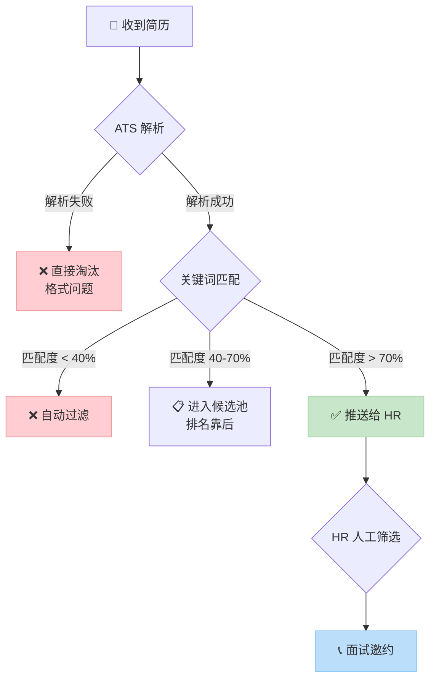

# ATS 关键词怎么写：让简历通过 AI 筛选的完整指南

> 本文深度解析了 ATS（求职者追踪系统）的工作原理与关键词匹配算法，旨在解决简历在 AI 筛选阶段被淘汰的核心问题。文章提供了从职位描述（JD）中精准提取和布局关键词的四步法，并附有互联网、金融、运营三大行业的“改前 vs 改后”实战案例，帮助求职者显著提升简历通过率。适合所有需要通过在线招聘系统投递简历的求职者阅读。

你的简历可能写得很好，但从未被真人看到过。这不是危言耸听，而是 ATS（Applicant Tracking System，求职者追踪系统）筛选下的残酷现实。据统计，超过 75% 的大中型企业使用 ATS 进行初筛，一份简历平均只有 6-7 秒的“机器阅读”时间。本文将为你拆解 ATS 的“黑箱”，并提供一套让简历顺利通过 AI 筛选的完整策略。

## ATS 如何工作：理解“机器面试官”的逻辑

ATS 的核心任务不是“欣赏”你的简历，而是“匹配”关键词。它的工作原理可以概括为：**解析 → 索引 → 匹配 → 排名**。

首先，ATS 会尝试解析你的简历文件（PDF/Word），将其中的文字信息结构化。如果简历格式复杂（如多栏排版、图形、非标准字体），解析可能失败，导致简历直接被淘汰。解析成功后，系统会将你的信息（技能、经验、教育背景等）建立索引，形成一个机器可读的数据库。

接下来，就是决定命运的关键词匹配环节。招聘人员通常会为职位设置一个包含核心技能、工具、证书、学位等关键词的“理想候选人画像”。ATS 会将你的简历索引与这个画像进行比对，计算匹配度（Match Rate）。这个匹配度直接决定了你的简历在系统中的排名和可见性。

下面的流程图清晰地展示了你的简历在 ATS 中的完整旅程：

由此可见，**优化关键词匹配度是穿越 ATS 筛选的唯一路径**。你的目标不是追求100%匹配，而是确保匹配度超过70%，进入被HR人工审阅的“安全区”。

## 四步法：从 JD 中精准提取 ATS 关键词

提升匹配度的关键在于“投其所好”。你需要像 SEO 专家一样，研究“搜索词”——也就是职位描述（JD）。以下是可立即执行的四步法：

### 第一步：拆解 JD，建立关键词词库
不要只是浏览 JD，而是要解剖它。将一份 JD 复制到文档中，用不同颜色高亮标注：
- **红色：硬技能**（工具、技术、平台）。如：Python, SQL, Tableau, AWS, Photoshop。
- **蓝色：软技能/能力**（方法论、流程）。如：数据分析、用户增长、项目管理、跨部门沟通。
- **绿色：行业术语与证书**。如：GAAP（会计准则）、PMP、CFA、KOL营销。
- **黄色：成果指标**。如：DAU（日活）、ROI（投资回报率）、转化率、客户满意度。

### 第二步：识别核心关键词与长尾关键词
- **核心关键词**：在 JD 中反复出现、或在“任职要求”部分明确列出的技能。例如，一个数据分析师岗位反复提及“Python”、“SQL”、“数据可视化”，这些就是核心关键词，必须出现在你的简历中。
- **长尾关键词**：是核心关键词的具体化或组合。例如，“A/B测试”是核心词，“设计并分析A/B测试以优化注册流程”就是包含了该核心词的长尾表述。在简历中同时使用核心词和长尾描述，能提升匹配的丰富度和语境相关性。

### 第三步：将关键词自然融入简历的“三区”
生硬地堆砌关键词会被ATS识别为“关键词堆砌”（Keyword Stuffing）而扣分。你需要将关键词自然地编织进以下三个区域：
1.  **专业摘要/个人总结**：开篇明义。例如：“具备3年以上互联网金融产品经验，精通**用户增长**与**数据分析**，擅长通过**SQL**提取数据并用**Python**建模，主导过提升**转化率**20%的项目。”
2.  **工作经验部分**：使用STAR法则（情境-任务-行动-结果）描述经历时，将关键词融入“行动”和“结果”。量化结果时使用JD中的**成果指标**。
3.  **技能专长部分**：分门别类列出你的技能，确保与JD中的**硬技能**高度重合。

### 第四步：使用同义词与相关术语
聪明的ATS会识别同义词和关联词。例如，JD要求“数据分析”，你的简历中除了出现“数据分析”，还可以出现“数据洞察”、“数据挖掘”、“定量分析”等关联表述。这能扩大你的匹配范围，避免因术语表述差异而被误判。

**Q: 如果 JD 要求的技术栈我只懂一部分，该怎么办？**
A: 诚实但策略性地呈现。对于你精通的部分，在经验和技能部分重点描述；对于你了解但未深入的部分，可以写在技能栏并标注“了解”或“熟悉”，而非“精通”。绝对不要虚构完全不存在的技能。更好的策略是，在投递前针对JD要求的关键技能进行快速学习，哪怕只是掌握基础概念，也能让你在简历和面试中更有底气。

## 实战案例：“改前 vs 改后”深度解析

理解了方法，我们来看具体案例。以下是三个不同行业的简历片段优化对比。

### 案例一：互联网行业 - 高级产品经理
**职位描述关键词提取**：产品规划、用户调研、原型设计、数据分析（DAU/留存）、Axure/Sketch、跨团队协作、商业化、KPI。

**改前（笼统、缺乏关键词）**：
> 负责XX APP的产品工作。设计了一些新功能，并推动上线。日常关注数据，和运营、技术部门沟通。

**改后（关键词融入、量化结果）**：
> - **产品规划与设计**：基于**用户调研**与竞品分析，主导XX核心功能模块的**产品规划**，使用 **Axure** 完成高保真**原型设计**，明确PRD文档，推动功能按期上线。
> - **数据分析与增长**：建立核心数据看板，监控 **DAU**、用户**留存率**等关键指标；通过**数据分析**定位流失节点，设计优化方案，使次月留存率提升 **15%**。
> - **跨部门协作与商业化**：协同技术、**运营**、市场团队，主导产品**商业化**路径设计，成功落地会员增值服务，实现季度营收 **KPI** 超额完成 **120%**。

**分析**：改后版本将JD中的核心关键词（加粗部分）无缝嵌入到具体的行动和结果中。“用户调研”、“Axure”、“DAU”、“留存率”、“数据分析”、“商业化”、“KPI”等词全部命中。同时，使用STAR结构并量化结果（提升15%，超额完成120%），不仅通过了ATS筛选，也给HR提供了清晰的价值证明。

### 案例二：金融行业 - 财务分析师
**职位描述关键词提取**：财务建模、预算编制、财务分析、风险管理、Excel/VBA、PPT报告、CPA/CFA（优先）、合并报表。

**改前（职责罗列、术语缺失）**：
> - 编制公司的月度财务报表。
> - 做一些预算分析和控制。
> - 制作管理层汇报的PPT。

**改后（专业术语、量化成果）**：
> - **财务建模与分析**：独立搭建公司五年期**财务预测模型**，用于**预算编制**与业务规划；通过敏感性分析评估**风险管理**，为投资决策提供数据支持。
> - **财务报告与管控**：负责月度**合并报表**编制及**财务分析**，利用 **Excel** 高级函数及 **VBA** 自动化处理流程，将报告生成效率提升 **40%**。
> - **管理层汇报**：制作面向董事会的高质量 **PPT** 分析报告，解读经营业绩与偏差，提出的成本控制建议被采纳后，帮助部门季度费用节约 **10%**。（**CPA** 在考）

**分析**：金融行业极度看重专业术语和证书。改后版本密集使用了“财务建模”、“预算编制”、“风险管理”、“合并报表”、“财务分析”、“Excel/VBA”、“PPT”、“CPA”等关键词，并展示了效率提升和成本节约的具体成果。“CPA在考”巧妙回应了JD中的证书偏好，即使未完全具备，也显示了积极态度。

**Q: 不同行业ATS关键词的侧重点有何不同？**
A: 差异显著。**互联网/科技**行业侧重具体技术栈（编程语言、软件工具）、方法论（敏捷开发、A/B测试）和核心指标（DAU、GMV、转化率）。**金融/咨询**行业更看重专业证书（CFA、CPA）、分析工具（Bloomberg、Wind）、财务术语（DCF模型、合并报表）和软技能（估值分析、尽职调查）。**市场/运营**行业则关注渠道（抖音、小红书）、技能（内容创作、SEO/SEM、KOL合作）、工具（Google Analytics、PS）和业绩指标（曝光量、粉丝增长、ROI）。在撰写简历前，务必研究目标行业的通用关键词库。

## 格式与排版的隐形规则

关键词内容固然重要，但承载内容的“容器”——简历格式，同样决定了解析的成败。

- **使用标准字体**：选择 Arial, Calibri, Georgia, Times New Roman 等ATS普遍支持的字体。避免使用罕见字体，它们可能被解析为乱码。
- **简化排版结构**：使用单栏、从上到下的线性结构。避免使用表格、文本框、图形、图标来承载核心文字信息，这些元素很可能无法被ATS正确读取。
- **正确的文件格式**：`.docx` 格式通常比 `.pdf` 解析兼容性更好。如果发送PDF，确保它是从文本创建（可复制），而非扫描图片。
- **章节标题标准化**：使用“Work Experience”、“Skills”、“Education”等标准章节标题，避免使用“My Journey”、“What I’m Good At”等创意性标题。
- **善用“技能”模块**：这是一个安全且高效的关键词陈列区。可以按“编程语言”、“数据分析工具”、“专业技能”等分类清晰列出。

对于希望快速获得一份ATS友好版式的求职者，可以参考专业的简历模板。例如，针对 **3-5年经验的产品经理**，就需要一份能突出产品全生命周期管理、数据量化成果和商业逻辑的结构化模板。这类模板通常采用清晰的分区、标准的标题和利于解析的排版，为你的关键词内容提供最佳展示框架。参考阅读：[【简历模板】8篇产品经理简历模板范文参考](https://wondercv.com/blog/xao0zras)

## 投递前后的终极检查清单

在点击“提交申请”按钮前，请完成以下清单：

- [ ] **格式检查**：简历是否为单栏、标准字体、无表格/图形文本框？保存为 `.docx` 或可复制文字的 `.pdf`。
- [ ] **关键词匹配度自测**：将你的简历文本和JD文本粘贴到一个在线文档对比工具（或简单使用Word的“比较”功能），直观查看关键词重合度。确保核心技能关键词无一遗漏。
- [ ] **量化成果**：每段经历是否至少包含一个可量化的成果（提升X%，节省Y天，完成Z金额）？
- [ ] **消除错误**：使用拼写和语法检查工具（如 Grammarly），确保无拼写错误，特别是技术术语和公司名的拼写。
- [ ] **定制化**：是否针对每一个投递的职位，微调了关键词和摘要？海投同一份简历是ATS筛选的大忌。
- [ ] **文件命名**：简历文件是否命名为“姓名_应聘职位_公司.pdf”的格式？这有助于HR后期查找。

完成简历优化后，你可以利用一些工具进行模拟ATS扫描。例如，**超级简历的ATS检测功能**可以基于你输入的JD，快速分析简历中的关键词匹配度、格式兼容性并提出优化建议，帮助你查漏补缺，在投递前将匹配度最大化。

## 总结：从“被人阅读”到“被机器识别”

在ATS主导的招聘时代，简历写作的第一要义已经从“打动人心”转变为“精准匹配”。你需要像优化搜索引擎排名一样优化你的简历。记住这个核心工作流：**解析JD提取关键词 → 将其自然融入简历“三区”（摘要、经历、技能）→ 确保格式机器可读 → 针对每个职位定制化投递**。

通过本文提供的四步法和行业案例，你可以系统性地提升简历的ATS通过率，让你的努力不再被冰冷的算法过滤掉。当你跨越了机器的第一道关卡，才有机会用你的真实才华去打动屏幕后的那个人。

---

## 相关资源

- [超级简历 WonderCV](https://wondercv.com) — ATS 友好简历模板库，AI 优化建议，一键导出 PDF
- [中文简历模板库](https://github.com/WonderCV-com/resume-templates) — 100+ 岗位专属模板
- [AI 求职工具合集](https://github.com/WonderCV-com/resume-skills-and-tools) — 提示词库与求职工作流
- [更多求职指南](https://github.com/WonderCV-com/resume-guide) — 简历写法 · 面试技巧 · 岗位攻略

> 本文由 WonderCV 内容团队出品，已帮助 **500 万+** 求职者。