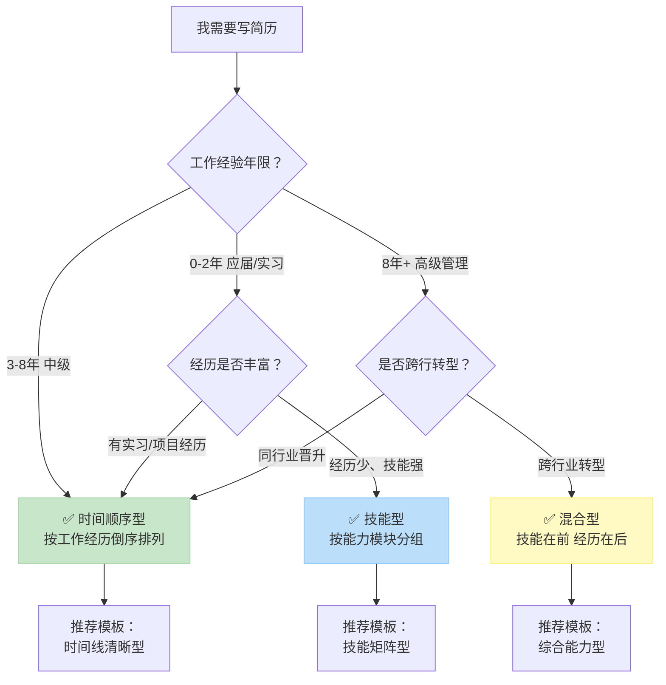

# 简历格式怎么选：时间顺序 vs 技能型 vs 混合型完全指南

> 本文系统对比了时间顺序型、技能型和混合型三种主流简历格式的核心特点与适用场景。通过决策流程图、改前改后案例分析和可执行步骤，帮助你根据自身工作经验、求职目标快速选择最优简历格式，有效提升简历通过率，尤其适合正在为简历排版犯难的应届生、转行者和中高级求职者。

选错简历格式，可能让你的所有努力付诸东流。一份结构不匹配的简历，即使内容再优秀，也可能在HR快速浏览的10秒内被直接筛掉。基于对超过500万份简历的分析，我们发现，**根据你的职业阶段和求职目标，精准选择简历格式，能让你的核心竞争力得到最高效的呈现**。本文将通过真实案例和决策树，帮你做出最佳选择。

## 一、 三大简历格式核心解析：你的经历该用什么方式“说话”？

简历格式本质上是信息组织和呈现的逻辑。选择哪种格式，取决于你希望HR以何种顺序、何种重点来“阅读”你的职业生涯。

### 1. 时间顺序型简历：最经典、最通用的“安全牌”

**时间顺序型简历**，又称逆序型简历，是按时间倒序列出你的工作/教育经历，最近的在最前。这是市场上最常见、ATS（求职者追踪系统）兼容性最高的格式。

**核心特点与适用场景：**
- **逻辑清晰**：呈现稳定、连续的职业发展路径。
- **优势突出**：当你有与目标岗位高度相关且出色的过往经历时，此格式能立刻抓住眼球。
- **通用安全**：绝大多数行业和HR都熟悉并认可此格式，几乎没有风险。

**Q：我刚毕业，只有一段实习经历，可以用时间顺序型简历吗？**
A：完全可以。对于应届生或经验较少的求职者，时间顺序型简历同样适用。关键在于如何填充模块。你可以将“工作经历”部分扩展为“相关经历”，按时间倒序列出你的实习、校园项目、课程设计甚至重要的兼职经历。这能清晰地展示你的成长轨迹和实践积累。参考阅读：[零实习也能写出彩：HR教你挖掘简历中的潜在优势](https://wondercv.com/blog/iu9bKoXg)，学习如何挖掘并结构化你的潜在经历。

**不适用情况**：职业空窗期过长、频繁跳槽、或计划跨行业转型时，此格式会放大你的职业弱点。

### 2. 技能型简历：以“能力”为中心，重塑职业叙事

**技能型简历**打破了时间线，将核心技能分类（如“项目管理”、“数据分析”、“用户研究”）作为一级标题，并在每个技能点下用相关项目、经历或成果来证明。

**核心特点与适用场景：**
- **能力导向**：直接回应岗位JD（职位描述）中的能力要求，方便HR进行关键词匹配。
- **淡化时间线**：完美规避职业空窗、频繁转岗或跨行业经验不连续等问题。
- **突出匹配度**：尤其适合技能突出但传统“经历”不那么亮眼的求职者，如程序员、设计师、研究员等。

**Q：我想从传统行业转行到互联网运营，没有直接经验怎么办？**
A：这正是技能型简历大显身手的时刻。不要纠结于“某公司某职位”的时间线。首先，深度拆解目标运营岗位的JD，提炼出“用户增长”、“活动策划”、“数据分析”、“内容创作”等核心技能模块。然后，从你过往的任何经历（即使是传统行业的市场活动、内部项目、甚至个人业余运营的社交媒体账号）中，提取能证明这些技能的案例，归类到相应技能模块下。这能强有力地告诉HR：“我虽无其名，但已有其实。”

**不适用情况**：对于要求严格背景调查、看重职业稳定性和连续性的行业（如金融、法律、部分国企），此格式可能显得不够严谨。

### 3. 混合型简历：强强联合的“组合拳”

**混合型简历**结合了前两者的优点：通常在简历前1/3部分设置一个醒目的“核心技能总结”或“专业概要”板块，以关键词或短句形式高度概括能力；后2/3部分仍按时间顺序展示工作经历，作为前半部分能力的佐证。

**核心特点与适用场景：**
- **开门见山**：让HR在5秒内抓住你的核心价值。
- **结构全面**：既展现了能力聚焦点，又提供了完整、可信的职业履历作为支撑。
- **适用广泛**：特别适合经验丰富的专业人士（5年以上）、管理者、或拥有多元技能组合的复合型人才。

**改前 vs 改后案例（项目经理 -> 高级产品经理）：**

> **改前（纯时间顺序型，开头是冗长的个人概述）：**
> **个人总结**：拥有8年软件行业工作经验，熟悉项目管理流程，具备团队管理能力，对产品开发有浓厚兴趣。工作认真负责，善于沟通。
> **工作经历**：
> 2016.04 - 至今  XX科技有限公司 项目经理
> - 负责A、B、C三个项目的全周期管理。
> - 协调研发、测试、设计团队，确保项目按时交付。
> - 管理10人团队，进行任务分配与进度跟踪。

> **改后（混合型，技能总结前置）：**
> **核心技能**：产品战略规划 | 用户需求洞察与PRD撰写 | 敏捷/Scrum项目管理 | 跨部门协作与团队领导（10人+） | 数据驱动决策
> **专业概要**：8年科技行业经验，从0到1主导过3款百万级用户产品的项目管理与迭代优化，擅长将业务需求转化为产品方案，并高效推动落地。
> **工作经历**：（随后按时间顺序详细展开，每个经历下的描述都围绕“核心技能”展开，用数据量化）
> 2016.04 - 至今  XX科技有限公司 项目经理 -> **高级产品经理**
> - **产品规划**：主导公司核心产品从V2.0至V4.0的迭代规划，基于用户调研与数据分析，定义核心功能优先级，产品MAU从50万增长至280万。
> - **项目管理**：采用敏捷开发模式，管理10人跨职能团队，平均将项目交付周期缩短20%，版本发布准时率达95%以上。
> - **……**

**分析**：改后的混合型简历，通过前置的“核心技能”和“专业概要”，瞬间将“项目经理”的身份重塑为“高级产品经理”的定位，直击目标岗位要求。后续的时间顺序经历则提供了具体、量化的证据。

## 二、 如何选择？一张决策流程图给你答案

面对三种格式，你是否感到选择困难？别担心，我们根据海量用户数据和HR反馈，总结出以下决策流程图。你可以直接根据你的情况对号入座。



**决策流程解读与行动指南：**

1.  **起点（0-2年经验，应届/实习）**：
    - **路径一（经历丰富）**：如果你有1-2段不错的实习、或高质量的校园项目/竞赛经历，**时间顺序型**是最佳选择。它能清晰展示你的实践轨迹。你可以直接使用**应届生通用简历模板**，其结构就是优化后的时间顺序型，能帮你突出优势，弥补经验长度不足。
    - **路径二（经历少、技能强）**：如果你实习经历薄弱，但通过自学掌握了扎实的技能（如编程、设计、数据分析软件），**技能型简历**能让你脱颖而出。将“技能”作为主模块，下面用课程大作业、个人项目、在线课程证书等作为证明。

2.  **路径（3-8年经验，中级）**：
    - 这是职业发展的黄金期，通常有清晰连贯的职业路径。**时间顺序型**是默认且最有效的选择，能有力展示你的成长、晋升和累积的成就。确保每段经历的描述都采用“动词+成果+数据”的格式。

3.  **路径（8年+经验，高级管理）**：
    - **路径一（同行业晋升）**：寻求更高管理职位（如总监、VP），**时间顺序型**或**混合型**均可。混合型能让你在开头就定下战略高度的基调。
    - **路径二（跨行业转型）**：**混合型简历是必选项**。你必须用前半部分的“技能总结”来重新锚定HR对你的认知，将过往经验“翻译”成新行业需要的通用能力（如领导力、商业洞察、复杂问题解决），后半部分的时间经历则作为能力和规模的背书。

## 三、 实战案例：不同背景下的格式应用与优化

### 案例一：应届生，一段家族企业实习经历
**背景**：市场营销专业应届生，唯一实习在家族企业担任市场助理。直接按时间顺序写，担心HR认为“水分大”。

**优化策略**：采用**时间顺序型**，但对“家族企业”经历进行“去个性化”处理，重点突出可迁移的技能和量化成果。

> **改前（平铺直叙，缺乏重点）：**
> **实习经历**
> 2023.07 - 2023.09  家族企业 - XX商贸有限公司  市场部助理
> - 协助处理市场部日常事务。
> - 帮忙运营公司微信公众号。
> - 参与了一次线下促销活动。

> **改后（强调能力与成果，弱化企业背景）：**
> **相关经历**
> 2023.07 - 2023.09  XX商贸有限公司（消费品零售）  市场部助理
> - **内容运营与增长**：独立负责公司微信公众号的日常内容策划、撰写与发布，实习期间通过优化选题与排版，使平均阅读量提升40%，粉丝数净增长1500+。
> - **市场活动执行**：作为核心成员参与“暑期促销”线下活动策划，负责物料协调与现场客户调研，活动期间门店客流量环比增加25%，成功收集有效用户问卷200份。
> - **竞品分析**：协助完成对3家主要竞品的市场活动与线上渠道的月度分析，并撰写报告，为部门调整营销策略提供数据支持。

**要点**：改后版本完全聚焦于“做了什么”、“怎么做的”、“结果如何”，使用了“独立负责”、“核心成员”等体现主动性的词汇，并用量化数据支撑成果。这正是参考了[简历优化：如何巧妙处理家族企业实习经历，提升竞争力？](https://wondercv.com/blog/xDTFZ4wB)中提到的“去个性化”和“能力转移”策略。

### 案例二：工作3年开发者，计划转行做数据科学
**背景**：有3年Java后端开发经验，自学了Python、机器学习，完成过几个Kaggle项目和在线课程。直接投数据科学岗位，时间顺序简历毫无优势。

**优化策略**：果断采用**技能型简历**。将“数据科学相关技能”作为核心展示区。

**可复制的技能型简历结构示例：**
```markdown
# 张三
目标岗位：初级数据科学家

## 核心技能
- **编程与工具**：Python (Pandas, NumPy, Scikit-learn), SQL, Git, Linux
- **机器学习**：熟悉回归、分类、聚类模型，有特征工程、模型调优经验
- **数据分析与可视化**：可使用Matplotlib/Seaborn进行数据探索与结果呈现

## 数据科学项目经历
### 电商用户购买预测（个人项目）
- **技能应用**：使用Python进行数据清洗、特征工程，构建并比较了逻辑回归、随机森林、XGBoost模型。
- **成果**：最终XGBoost模型在测试集上达到AUC 0.85，准确识别出高潜力购买用户群体。

### 房价预测分析（Kaggle竞赛项目）
- **技能应用**：运用了缺失值处理、异常值检测、特征缩放，并尝试了多种集成学习方法。
- **成果**：在公开排行榜上取得前15%的成绩。

## 其他工作经历
（此处可简略按时间顺序列出你的Java开发工作，证明你的工程背景和职场素养，但描述精简）
2020.07 - 至今  XX软件公司  Java后端开发工程师
- 负责微服务模块开发与维护...
```

**要点**：这份简历让HR一眼就看到你与“数据科学家”的匹配度，自学项目和竞赛成绩被置于最显眼的位置，而原有的开发经验则作为补充证明你的工程能力。

## 四、 最终检查清单与行动步骤

在确定格式并完成初稿后，请对照此清单进行最终审查：

- [ ] **格式选择验证**：我的简历格式是否最适合我当前的职业阶段和求职目标？（回顾第二节流程图）
- [ ] **首屏冲击力**：无论哪种格式，HR在不用滚动鼠标的情况下（简历前1/3处），是否能立刻明白“我是谁”、“我有什么核心价值”？
- [ ] **经历描述质量**：每段经历是否遵循“行动动词 + 具体工作内容 + 可量化成果”的公式？（例如：“通过**优化**登录流程，**将**用户注册转化率**提升了**20%”）
- [ ] **关键词匹配**：我的简历中是否包含了目标职位JD中的高频关键词（尤其是技能名词）？
- [ ] **ATS兼容性**：简历是否使用简单清晰的排版、标准字体、避免表格和文本框？超级简历的ATS检测功能可以帮助你扫描简历，识别可能被系统误读的格式问题。
- [ ] **针对性调整**：我是否为不同的公司/岗位微调了简历的重点？（尤其是技能型和混合型简历，前置的技能模块应针对JD定制）

**立即行动步骤：**
1.  **明确目标**：列出你最想申请的2-3个目标岗位，仔细阅读其JD。
2.  **自我评估**：根据第二节的决策流程图，确定你的简历格式。
3.  **选择模板**：根据格式选择对应的专业模板。例如，选择时间顺序型可以参考**实习生通用简历模板**的清晰结构；技能型则可以寻找突出技能矩阵的模板。
4.  **填充与优化**：按照格式要求填充内容，并运用上文中的案例技巧进行优化。
5.  **检测与校对**：完成初稿后，进行拼写检查，并通读检查逻辑流畅性。

记住，简历格式是骨架，内容是血肉。选择正确的骨架，才能让你精心准备的内容以最有力、最有效的方式呈现出来。

---

## 相关资源

- [超级简历 WonderCV](https://wondercv.com) — ATS 友好简历模板库，AI 优化建议，一键导出 PDF
- [中文简历模板库](https://github.com/WonderCV-com/resume-templates) — 100+ 岗位专属模板
- [AI 求职工具合集](https://github.com/WonderCV-com/resume-skills-and-tools) — 提示词库与求职工作流
- [更多求职指南](https://github.com/WonderCV-com/resume-guide) — 简历写法 · 面试技巧 · 岗位攻略

> 本文由 WonderCV 内容团队出品，已帮助 **500 万+** 求职者。